# CutiELink SDK Architecture

This document describes the architecture of the CutiELink iOS SDK using C4 diagrams.

## Overview

CutiELink is a lightweight SDK that enables "Open in Feedback App" functionality. Unlike the full CutiE SDK (which embeds feedback UI), CutiELink simply links users to the standalone Cuti-E Feedback App via deep links.

---

## C4 Model

### Level 1: System Context

Shows how the SDK connects apps to the Cuti-E ecosystem.

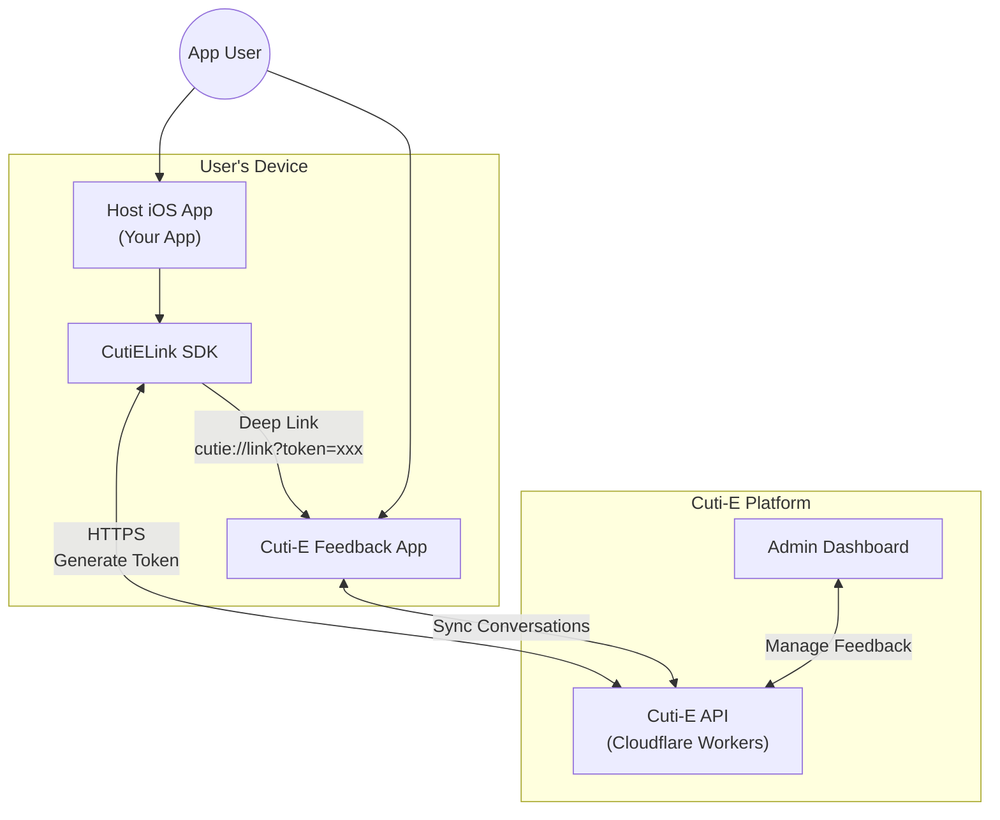

### Comparison with Full SDK

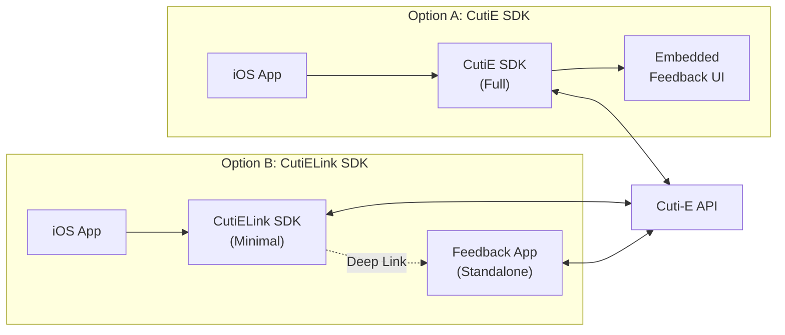

---

### Level 2: Container Diagram

Shows the SDK structure and dependencies.

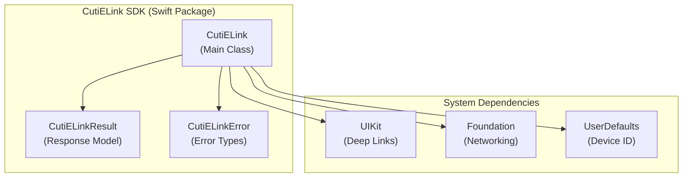

---

### Level 3: Component Diagram

Shows internal structure of the CutiELink class.

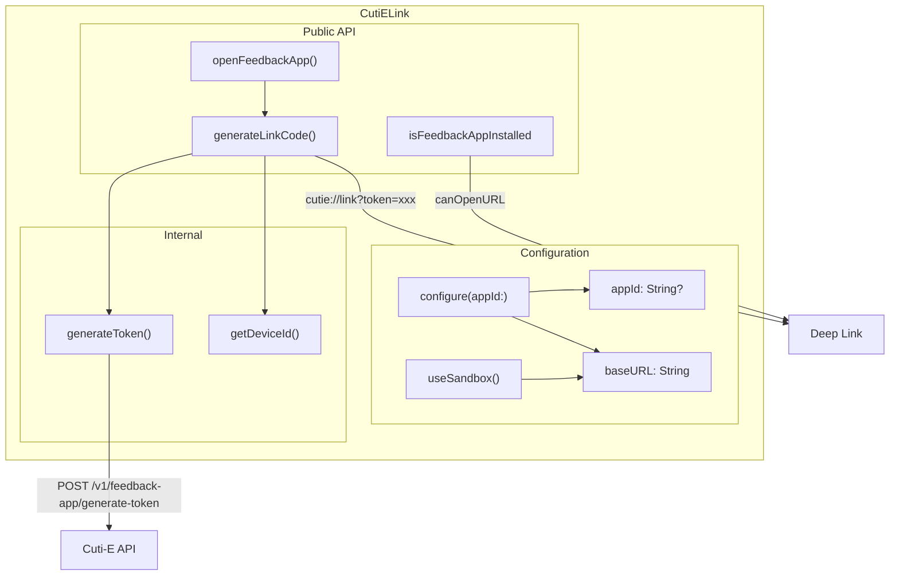

---

## Data Flow Diagrams

### Open Feedback App Flow

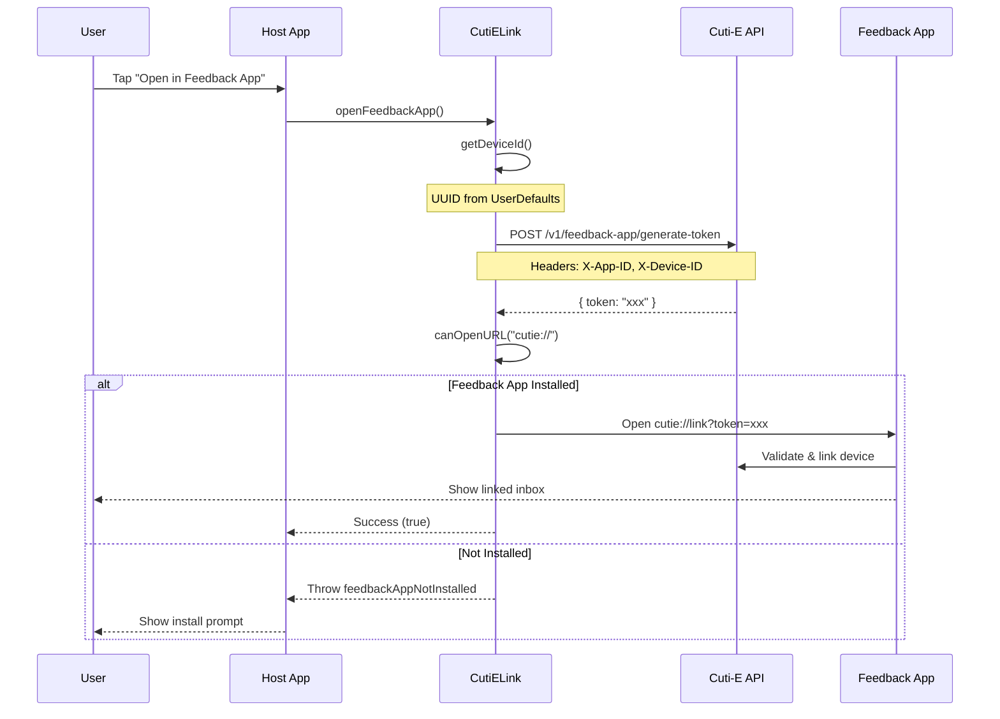

### Generate Link Code Flow (Manual Fallback)

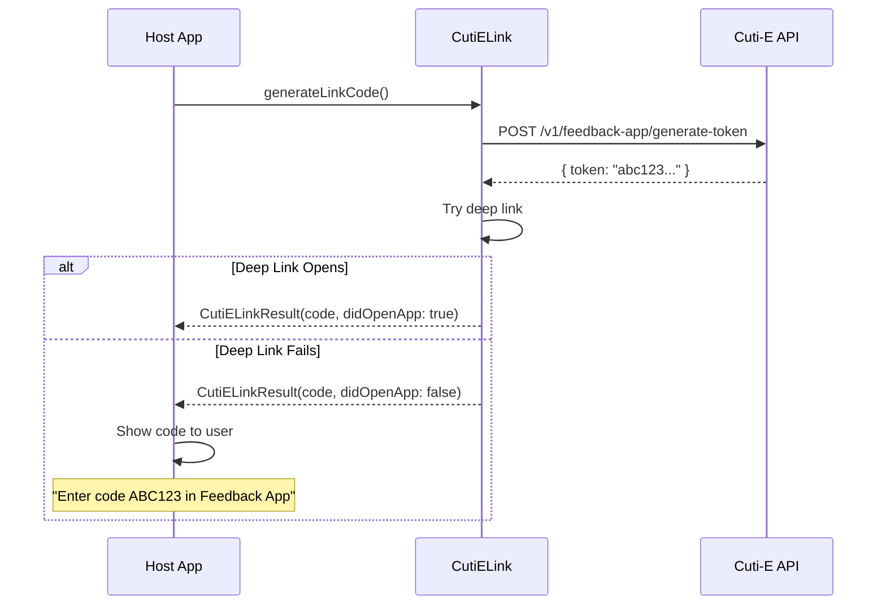

---

## API Communication

### Token Generation Request

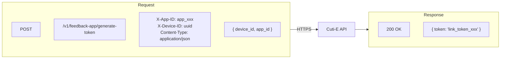

### Error Handling

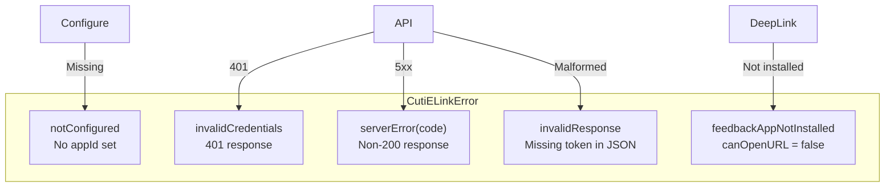

---

## Deep Link Integration

### URL Scheme

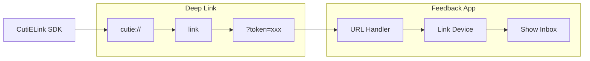

### Info.plist Requirement

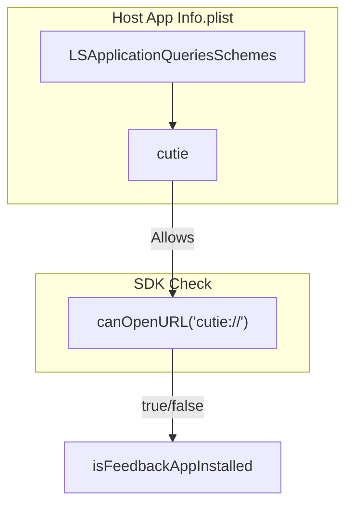

---

## Security

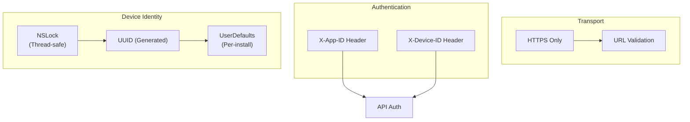

---

## Module Structure

```
Sources/CutiELink/
└── CutiELink.swift          # Everything in one file
    ├── CutiELink (class)     # Main singleton
    ├── CutiELinkResult       # Success response
    └── CutiELinkError        # Error types
```

### Public API Surface

| Method/Property | Description |
|-----------------|-------------|
| `configure(appId:apiURL:)` | Set App ID and optional custom API URL |
| `useSandbox()` | Switch to sandbox environment |
| `openFeedbackApp()` | Generate token and open Feedback App |
| `generateLinkCode()` | Generate token with manual fallback |
| `isFeedbackAppInstalled` | Check if Feedback App is installed |

---

## Platform Requirements

| Requirement | Value |
|-------------|-------|
| iOS | 14.0+ |
| Swift | 5.7+ |
| Dependencies | UIKit, Foundation only |
| Size | ~3KB compiled |

---

## Comparison: CutiE vs CutiELink

| Feature | CutiE SDK | CutiELink SDK |
|---------|-----------|---------------|
| Feedback Form | Embedded | External app |
| Push Notifications | Yes | No (handled by Feedback App) |
| Inbox View | Yes | No (handled by Feedback App) |
| App Attest | Yes | No |
| Certificate Pinning | Yes | No |
| Size | ~50KB | ~3KB |
| Complexity | Full-featured | Minimal |
| Use Case | Self-contained feedback | Link to Feedback App |
